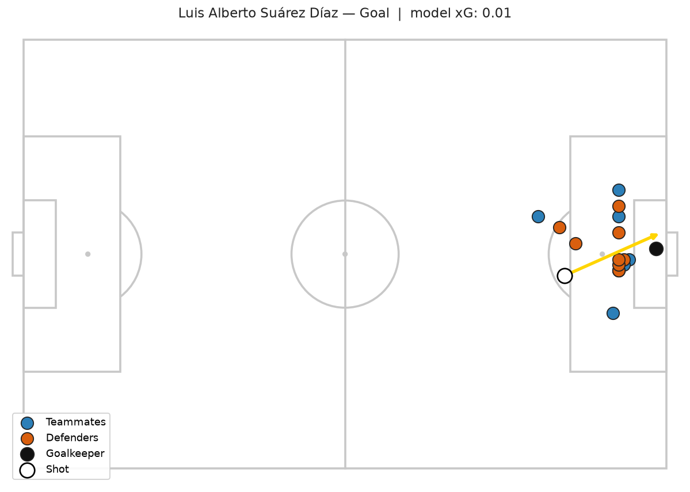
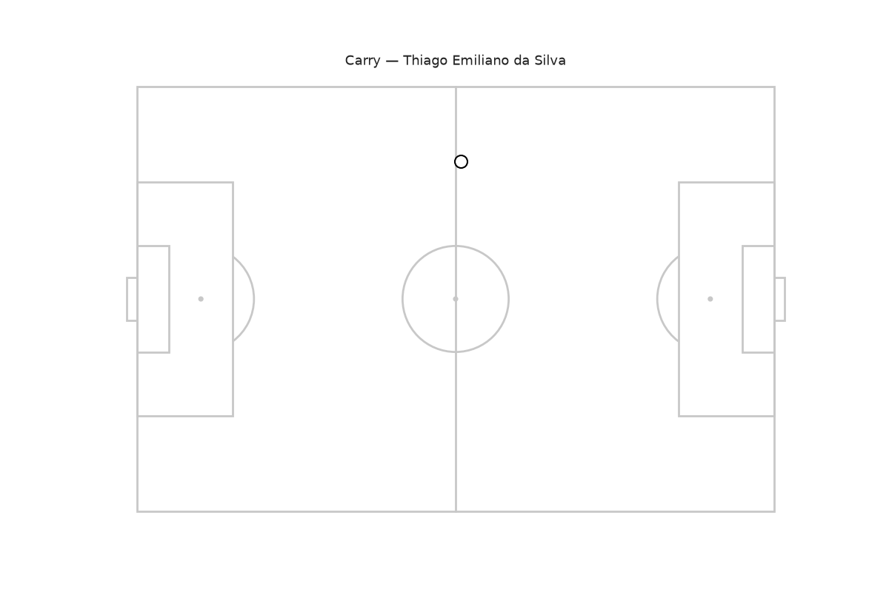

# PitchSense

An interactive tool that teaches football tactics and concepts (xG, pressing, offside, formations) by replaying real match data as animations, asking you to predict outcomes, and comparing your guess against a trained machine-learning model — with difficulty that adapts to your weak areas.

Unlike a typical xG dashboard, the whole point here is a real pipeline: **real match data → trained ML models → animated replay → interactive quiz → adaptive personalization.** The predictions come from models trained on data, not from an LLM pretending to be a football expert.

## Problem

"How likely was that shot to score?" is something even experienced fans disagree on. Expected Goals (xG) answers it with data: given where a shot was taken and what was happening around it, what share of similar shots historically became goals? PitchSense trains that model and then uses it as a yardstick to help a learner build intuition.

## Data

- **Source:** [StatsBomb Open Data](https://github.com/statsbomb/open-data) — free, public, real professional match events.
- **Competition used:** FIFA World Cup 2018 (`competition_id=43`, `season_id=3`), 64 matches.
- Data is pulled on demand via `statsbombpy` and cached locally under `data/` (git-ignored, not committed).

## Approach (Phase 1 — baseline xG model)

For every shot we engineer features from the event and its freeze-frame (the snapshot of player positions at the moment of the shot):

| Feature | Meaning |
|---|---|
| `distance` | Distance from the shot to the centre of the goal |
| `angle` | Angle of the goal mouth visible from the shot location (wider = easier) |
| `defenders_in_cone` | Opponents inside the triangle between the shot and the two goal posts |
| `is_header` | Headed shot |
| `is_first_time` | Struck first time, without a touch to control |
| `is_one_on_one` | One-on-one against the keeper |
| `under_pressure` | A defender was closing the shooter down |
| `from_open_play` | Regular open play vs. a set-piece pattern |
| `assist_cross` | The assisting pass was a cross |
| `assist_cutback` | The assisting pass was a cutback |
| `assist_through_ball` | The assisting pass was a through ball |

The assist features are joined from the assisting pass event via each shot's
`shot_key_pass_id`.

**Target:** whether the shot was a goal. Penalties are excluded — they score far more often than open play and would distort the model.

**Models:** two are trained and compared — Logistic Regression (standardized
features) and XGBoost. The pipeline picks whichever has the lower held-out log
loss as the model it serves; it is not hardcoded.

## Results (held-out test set)

Trained on World Cup 2018 (1,638 open-play shots, 8.2% goal rate, 11 features):

| Model | ROC AUC | Log loss | Brier |
|---|---|---|---|
| **Logistic Regression** (served) | **0.758** | **0.242** | **0.066** |
| XGBoost | 0.708 | 0.267 | 0.073 |

On this single-competition dataset the linear model wins on every metric. That
is the expected outcome, not a bug: with only ~135 goals, a gradient-boosted
tree overfits, whereas the core xG signal (distance and angle) is smooth and
close to linear in log-odds — exactly what logistic regression models well. The
tree should overtake it once the training set is expanded across competitions.

The served model is well calibrated: for its highest-probability bucket of shots
it predicts ~0.36 and the actual goal rate is ~0.39. For reference, StatsBomb's
own production xG reaches ~0.78–0.80 AUC using more features (including richer
freeze-frame geometry), so this baseline sits in a sensible range.

Both models are saved (`models/xg_logreg.joblib`, `models/xg_xgboost.joblib`),
the served model is copied to `models/xg_baseline.joblib`, and the full
comparison is written to `models/xg_metrics.json` on every training run.

## Project layout

```
src/pitchsense/
  data.py       # load & cache StatsBomb shots
  features.py   # pitch geometry + feature engineering (pure, tested)
  train.py      # train, evaluate, and save the baseline model
  pitch.py      # draw a football pitch in StatsBomb coordinates
  viz.py        # render a shot + its freeze-frame, annotated with model xG
  sequences.py  # build an interpolated ball track from a possession
  animate.py    # render a possession as an animated replay (GIF)
  quiz.py       # scoring and explanation for predict-and-compare
  concepts.py   # concept tagging, per-concept progress, adaptive shot selection
  possessions.py # possession -> tactical feature vector (pure, tested)
  tactics.py    # cluster possessions into tactical patterns (k-means)
streamlit_app.py  # interactive quiz UI
tests/          # unit tests for the geometry, features, and rendering
data/           # cached raw data (git-ignored)
models/         # trained models + metrics (git-ignored)
docs/           # rendered example figures
```

## Visualization

Any shot can be drawn on a pitch with its freeze-frame — the shooter, teammates,
defenders, and goalkeeper as StatsBomb recorded them at the moment of the shot —
with the ball's path and the model's xG in the title. This is the visual layer
the interactive quiz will later pause on.



The example above is a Luis Suárez goal the model rates at just 0.03 xG: a tight
chance struck through a crowded box. Regenerate it with `python -m pitchsense.viz`.

### Animated replay

A whole possession can be replayed as a moving ball. StatsBomb records discrete
events rather than continuous tracking, so the ball is walked through the
possession's on-ball actions (passes, carries, the shot) and interpolated
between their start and end locations, with a trail and a caption naming the
current action and player.



The replay above is a full goal build-up. Regenerate it with
`python -m pitchsense.animate`. When the tactical classifier (below) has been
trained, the replay is captioned with the pattern it detects for the possession
— the example above reads *Counter-attack / direct*.

## Interactive quiz

The pieces above come together in a Streamlit app. It shows a real shot's
freeze-frame with the outcome hidden, you estimate the chance it scores, and it
then reveals the actual result, the model's xG, and a plain-language explanation
of the situation. Your estimates are scored against the outcome with the Brier
rule and compared to the model's own score, so you can see how your intuition
stacks up against a model trained on real shots.

```bash
streamlit run streamlit_app.py
```

### Adaptive practice

Every shot is tagged with the football concepts it exercises — a header, a
long-range effort, a one-on-one, a chance struck through a crowded box — derived
from its features. The quiz keeps a running average of your points per concept
and biases which shot comes next toward the concepts you estimate worst,
alongside an exploration nudge so unseen concepts still surface early. A
"Where you stand" panel shows your per-concept scores, weakest first, so the
practice concentrates where your intuition is furthest from the model's. The
tagging, progress tracking, and weighted selection are pure functions in
`concepts.py`, kept free of any UI so they can be unit tested.

## Tactical pattern classifier

Beyond single shots, PitchSense classifies whole **possessions** by *how* the
ball was moved. StatsBomb has no ground-truth tactical labels, so this is
unsupervised: each possession is reduced to shape-and-tempo features and the
possessions are grouped with k-means, then the discovered clusters are named by
inspecting their centroids. The labels are an interpretation of the clusters,
not taught targets — the honest framing for an unsupervised model.

Per possession (`possessions.py`, pure and tested) we measure duration, number
of passes, how far and how directly it moved upfield (`net_forward`,
`directness`), how fast (`forward_speed`), its lateral spread, where it started,
and whether it ended in a shot. Possessions with fewer than three on-ball
actions are dropped as too short to carry a pattern.

Trained on all 64 World Cup 2018 matches (**8,307 possessions**, k=3, silhouette
**0.26**), the three clusters map cleanly onto the archetypes the project
targets:

| Pattern | Share | Passes | Duration | Upfield | Directness | Speed | Ends in shot |
|---|--:|--:|--:|--:|--:|--:|--:|
| **Counter-attack / direct** | 3,573 | 3.8 | 10.9s | 54.8y | 0.52 | 6.7 y/s | 12% |
| **Patient build-up** | 1,790 | 15.4 | 50.5s | 55.9y | 0.15 | 1.3 y/s | 22% |
| **Quick regain / transition** | 2,944 | 5.3 | 15.5s | 10.9y | 0.07 | 0.7 y/s | 14% |

The clusters are genuinely distinct and readable: counter-attacks are short,
fast, and strike straight at goal; build-ups string together ~15 patient passes
over ~50 seconds, cover the most width, and produce the most shots; the third
group starts highest up the pitch (average start ~74 of 120 yards) and makes
little further ground — balls won high and used quickly. The silhouette of 0.26
is modest, as expected for real football possessions that overlap rather than
fall into clean islands; the value is reported so the k=3 choice can be
sanity-checked, and the cluster naming is a deterministic, unit-tested ranking of
the centroids rather than a hand-placed guess.

The model and a full cluster summary are saved to `models/tactics_kmeans.joblib`
and `models/tactics_metrics.json` on every training run, and the animated replay
is captioned with the pattern the classifier assigns to the possession being
shown.

## Setup

Requires Python 3.11+.

```bash
python -m venv .venv
.venv/Scripts/activate        # Windows
# source .venv/bin/activate   # macOS / Linux
pip install -r requirements.txt
```

## Run

```bash
# Train and evaluate the baseline xG model (downloads & caches data on first run)
PYTHONPATH=src python -m pitchsense.train

# Render an example shot with its freeze-frame to docs/example_shot.png
PYTHONPATH=src python -m pitchsense.viz

# Render an animated replay of a goal build-up to docs/example_sequence.gif
PYTHONPATH=src python -m pitchsense.animate

# Cluster possessions into tactical patterns and print the cluster summary
PYTHONPATH=src python -m pitchsense.tactics

# Launch the interactive quiz
streamlit run streamlit_app.py

# Run the tests
pytest
```

## What's tested

- Pitch geometry: distance, shot angle (relative ordering and bounds), and the
  defenders-in-cone point-in-triangle logic, including teammate/opponent handling,
  missing freeze-frames, and numpy-array locations from the parquet cache.
- Feature frame assembly: penalties dropped, goals labelled, header flag, and the
  assist-type features (present and defaulted-to-zero cases).
- Rendering: the pitch has correct extent and markings, and freeze-frame players
  are grouped into teammates, defenders, and goalkeeper (including numpy-array
  locations and missing/incomplete entries).
- Sequence building: end-location selection by event type, waypoint merging of
  touching points, frame interpolation counts/endpoints, and filtering a
  possession to the team's on-ball actions.
- Quiz logic: Brier scoring (including clamping), the model-comparison verdict,
  and the explanation text.
- Adaptive practice: concept tagging (each threshold, the assist/situation flags,
  and the standard-chance fallback), progress accumulation and per-concept
  averages, weighting weak and unseen concepts above strong ones, and that the
  weighted shot selection is valid and biases toward the neediest shots.
- Tactical patterns: possession feature engineering (forward progress, duration,
  path length and directness, the same-second speed guard, opponent-touch and
  short-possession filtering, frame assembly and tagging) and the cluster
  labeller (relative ranking of centroids onto the archetypes, every cluster
  named once, centroid averaging). The replay's pattern caption degrades
  gracefully to nothing when the classifier has not been trained.

The Streamlit flow (initial render, guessing, revealing, next shot) is checked
end-to-end with Streamlit's AppTest harness as a manual smoke test; it needs the
data cache present and so is run by hand rather than in the pytest suite.

Not yet tested end-to-end: the live data fetch (it hits the network) is exercised
manually via `python -m pitchsense.train`.

## Known limitations

- Single competition (World Cup 2018) — a larger multi-competition training set
  would improve and stabilise the model, and is what would let XGBoost overtake
  the linear baseline.
- No hyperparameter search or cross-validation yet; metrics come from a single
  train/test split with a fixed seed.
- Freeze-frame geometry is summarised as a single defenders-in-cone count; the
  keeper's position and finer spatial detail aren't used yet.
- The tactical clusters are unsupervised and unlabelled by nature: their names
  are a reasonable reading of the centroids, not validated against coached
  ground truth, and the silhouette (0.26) reflects genuinely overlapping play.

## Roadmap

1. **Data + baseline xG model** (Logistic Regression vs XGBoost, assist-type
   features) — done.
2. **Static pitch visualization** (shot + freeze-frame, annotated with xG) — done.
3. **Animated replay** of a possession (interpolated ball track) — done.
4. **Quiz layer**: estimate, compare to the model, explain the gap (Streamlit) — done. **MVP complete.**
5. **Adaptive difficulty + per-concept progress tracking**: concept tagging,
   per-concept scoring, weak-area-biased shot selection, progress panel — done.
6. Stretch: **tactical pattern classifier** (k-means over possessions, labelled
   into build-up / counter-attack / regain, wired into the replay) — done.
   Remaining: player-role clustering, leaderboard.
