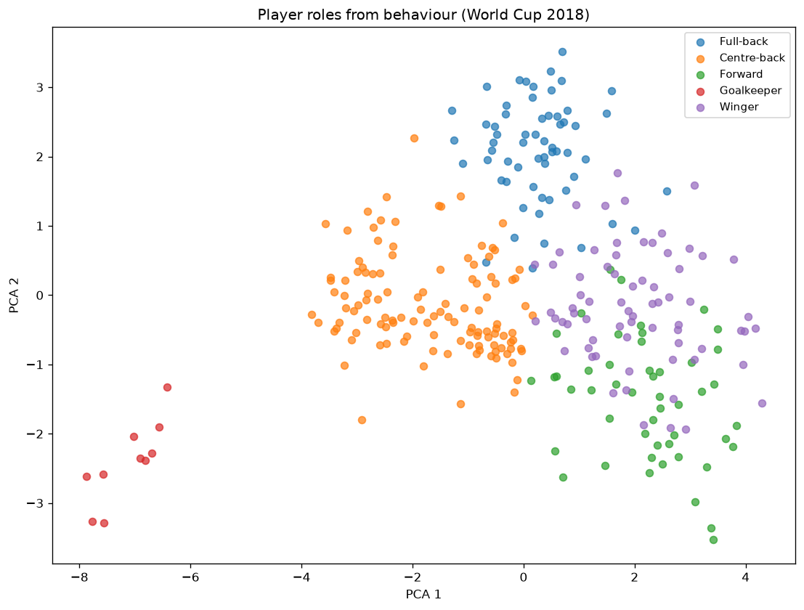

# PitchSense

An interactive tool that teaches football tactics and concepts (xG, pressing, offside, formations) by replaying real match data as animations, asking you to predict outcomes, and comparing your guess against a trained machine-learning model — with difficulty that adapts to your weak areas.

Unlike a typical xG dashboard, the whole point here is a real pipeline: **real match data → trained ML models → animated replay → interactive quiz → adaptive personalization.** The predictions come from models trained on data, not from an LLM pretending to be a football expert.

## Problem

"How likely was that shot to score?" is something even experienced fans disagree on. Expected Goals (xG) answers it with data: given where a shot was taken and what was happening around it, what share of similar shots historically became goals? PitchSense trains that model and then uses it as a yardstick to help a learner build intuition.

## Data

- **Source:** [StatsBomb Open Data](https://github.com/statsbomb/open-data) — free, public, real professional match events.
- **Competitions used:** four major men's international tournaments — FIFA World
  Cup 2018 and 2022, and UEFA Euro 2020 and 2024 — **230 matches** in total. They
  are all national-team knockout tournaments with full event data and shot
  freeze-frames, so they are stylistically comparable and share the same feature
  coverage. The set is configured in one place (`COMPETITIONS` in `data.py`).
- Data is pulled on demand via `statsbombpy` and cached locally under `data/`
  (git-ignored, not committed). Because all three models read the same raw
  events, `python -m pitchsense.build_data` fetches every match once and writes
  all three caches together, rather than downloading the matches three times.

## Approach (Phase 1 — baseline xG model)

For every shot we engineer features from the event and its freeze-frame (the snapshot of player positions at the moment of the shot):

| Feature | Meaning |
|---|---|
| `distance` | Distance from the shot to the centre of the goal |
| `angle` | Angle of the goal mouth visible from the shot location (wider = easier) |
| `defenders_in_cone` | Opponents inside the triangle between the shot and the two goal posts |
| `nearest_defender_dist` | Distance to the closest opponent outfielder — how much space the shooter had |
| `defenders_behind_ball` | Opponent outfielders goal-side of the shot (between ball and goal line) |
| `keeper_dist_to_goal` | How far the goalkeeper was off their line |
| `keeper_dist_to_ball` | Distance from the keeper to the shot — small values are near one-on-ones |
| `keeper_in_cone` | Whether the keeper is inside the shot cone, guarding the direct lane |
| `defenders_in_lane` | Opponents on the straight line from the ball to the goal centre |
| `is_header` | Headed shot |
| `is_first_time` | Struck first time, without a touch to control |
| `is_one_on_one` | One-on-one against the keeper |
| `under_pressure` | A defender was closing the shooter down |
| `from_open_play` | Regular open play vs. a set-piece pattern |
| `assist_cross` | The assisting pass was a cross |
| `assist_cutback` | The assisting pass was a cutback |
| `assist_through_ball` | The assisting pass was a through ball |

The four freeze-frame features read the snapshot of every tracked player at the
instant of the shot: the goalkeeper (found by position name) gives the two keeper
distances, and the opponents give the nearest-defender and defenders-behind-ball
counts. When a shot has no freeze-frame these default sensibly (open space, keeper
on its line). The assist features are joined from the assisting pass event via
each shot's `shot_key_pass_id`.

**Target:** whether the shot was a goal. Penalties are excluded — they score far more often than open play and would distort the model.

**Models:** two are trained and compared — Logistic Regression (standardized
features) and XGBoost. Each one's hyperparameters are tuned by 5-fold
cross-validated search on the training data (a grid over the linear model's
regularisation strength, a 40-point randomized search over the XGBoost tree
parameters), optimising log loss because xG needs to be *calibrated*, not just
correctly ranked. The pipeline serves whichever tuned model has the lower
cross-validated log loss; it is not hardcoded.

## Results

Each model is reported two ways: **cross-validated** metrics (mean ± std over the
five training folds, which show stability) and a **held-out test set** never
touched during the search (an unbiased final number).

Trained across four tournaments (5,606 open-play shots, 9.0% goal rate, 17
features):

| Model | CV log loss | CV ROC AUC | Test log loss | Test ROC AUC |
|---|--:|--:|--:|--:|
| **Logistic Regression** (served) | 0.252 ± 0.010 | 0.788 ± 0.026 | 0.262 | 0.767 |
| XGBoost | 0.253 ± 0.008 | 0.788 ± 0.024 | 0.255 | 0.779 |

The story here is the freeze-frame. The first batch of geometry features —
nearest defender, defenders behind the ball, and the two goalkeeper distances —
lifted cross-validated AUC from ~0.778 to **0.788** and cut CV log loss from
0.256 to ~0.252, and it also tightened the fold-to-fold spread. That is the
lesson an earlier step predicted: with the models already tuned, the gain came
from better *features*, not a fancier algorithm. A second batch (the two
shooting-lane features, `keeper_in_cone` and `defenders_in_lane`) barely moved the
numbers — honestly reported — because that signal was already largely captured by
the defender counts and keeper distances; they are kept as cheap, interpretable
additions but were not the win.

**Cross-validation shows the two models are essentially tied**: their CV metrics
are identical to two decimals and sit well within one standard deviation of each
other. Logistic regression wins the CV-log-loss tie by the barest margin and stays
the served model, though XGBoost is a shade ahead on the held-out test set (0.779
vs 0.767 AUC). Reporting both keeps the choice honest rather than reading too much
into a single split. (Where the tree *does* pull clear is the post-shot model
below.)

The served model stays well calibrated: across ten probability buckets its
predictions track the actual goal rate closely, with only mild over-prediction in
the highest bucket (predicts ~0.34, actual ~0.30). For reference, StatsBomb's own
production xG reaches ~0.78–0.80 AUC using still more features, so this model now
sits right in that range.

Both tuned models are saved (`models/xg_logreg.joblib`, `models/xg_xgboost.joblib`),
the served model is copied to `models/xg_baseline.joblib`, and the full comparison
— best hyperparameters, per-fold CV metrics, and test metrics — is written to
`models/xg_metrics.json` on every training run.

## Post-shot xG (PSxG)

The model above is *pre-shot* xG: it rates the chance from the situation before
the ball is struck. A natural companion question is "given the shot was taken and
placed **there**, how likely was it to score?" — **post-shot** xG (PSxG), which
measures shot execution and goalkeeping. The difference is one feature: where the
ball ended up. `shot_end_location` gives the ball's lateral position in the goal
and its height, which become `placement_from_center` and `placement_height`.

That placement is the *result* of the shot, not a condition known before it, so
it is deliberately kept **out** of the served xG model — folding it in would be
target leakage and stop the model being a real "expected goals". Instead it lives
in a separate model (`postshot.py`) that reuses the pre-shot features and adds the
two placement features on top. By convention PSxG is defined only over **on-target**
shots (goals and saves — the ones a keeper had to deal with), since an off-target
shot never had a placement that could score. That leaves 1,753 shots at a 28.9%
goal rate. The same cross-validated search as the pre-shot model is reused.

| Model | CV log loss | CV ROC AUC | Test log loss | Test ROC AUC |
|---|--:|--:|--:|--:|
| Logistic Regression | 0.500 ± 0.019 | 0.779 ± 0.022 | 0.533 | 0.758 |
| **XGBoost** (served) | **0.424 ± 0.029** | **0.851 ± 0.025** | **0.420** | **0.855** |

**This is where the gradient-boosted tree finally pulls clear of the linear
model** — by a wide margin (0.851 vs 0.779 CV AUC), not the coin-flip of the
pre-shot task. Placement is strongly non-linear: a shot into either top corner is
lethal, one straight at the keeper is not, and the value depends on lateral
position and height *together*. A logistic regression, additive in its features,
cannot represent that "corner" interaction; a tree carves it out naturally. So on
this task the pipeline selects XGBoost as the served post-shot model — the answer
to the earlier open question of when the tree would earn its place. The model and
metrics are saved to `models/psxg_*.joblib` and `models/psxg_metrics.json`, and
the quiz surfaces it: on a revealed on-target shot it shows the post-shot xG next
to the pre-shot xG, so a struck-well goal reads as a good finish on top of a good
chance.

## Does it generalise to an unseen tournament?

A random train/test split lets shots from every tournament appear in both halves,
so a model could quietly learn tournament-specific quirks and still score well. A
stricter test holds out one whole tournament, tunes and trains on the other three,
and evaluates on the unseen one — repeated with each tournament held out in turn
(leave-one-tournament-out). The search is re-run inside each fold on the three
training tournaments only, so the held-out one never influences model selection.

| Held out → | WC 2018 | WC 2022 | Euro 2020 | Euro 2024 | Mean | Random split |
|---|--:|--:|--:|--:|--:|--:|
| Logistic Regression | 0.770 | 0.806 | 0.782 | 0.763 | **0.780** | 0.767 |
| XGBoost | 0.781 | 0.809 | 0.796 | 0.763 | **0.787** | 0.779 |

(ROC AUC on the held-out tournament.) The reassuring result: **there is no
generalisation gap** — the leave-one-tournament-out mean is as good as the
random-split score, so the model is not riding competition-specific quirks and
would transfer to a tournament it has never seen. That is what you would hope for
from features grounded in the physics of a shot — distance, angle, and defender
geometry do not change between competitions. XGBoost edges the linear model on the
average and in three of the four held-out tournaments, a slightly firmer signal
for the tree than the single random split gave. Euro 2024 is the hardest to
predict for both models, with the fewest goals (98) and so the noisiest estimate.

The **post-shot model** stands up to the same test on its on-target shots:

| Held out → | WC 2018 | WC 2022 | Euro 2020 | Euro 2024 | Mean | Random split |
|---|--:|--:|--:|--:|--:|--:|
| Logistic Regression | 0.763 | 0.777 | 0.761 | 0.758 | **0.765** | 0.758 |
| XGBoost | 0.787 | 0.868 | 0.884 | 0.859 | **0.849** | 0.855 |

Again no gap — XGBoost's leave-one-out mean (0.849) matches its random-split score
— and, more tellingly, **XGBoost beats the linear model on every one of the four
held-out tournaments**. That confirms the placement non-linearity it exploits is a
real, transferable effect, not an artefact of one lucky split: the value of a
top-corner finish carries over to competitions the model never trained on.

Neither evaluation changes a served model; each writes a report to
`models/xg_generalisation.json` / `models/psxg_generalisation.json`. Run them with
`python -m pitchsense.generalisation` and `python -m pitchsense.generalisation psxg`.

## Project layout

```
src/pitchsense/
  data.py       # competition config + load & cache StatsBomb shots
  build_data.py # single-pass fetch that builds all three caches at once
  features.py   # pitch geometry + feature engineering (pure, tested)
  train.py      # tune, cross-validate, evaluate, and save the pre-shot xG model
  postshot.py   # post-shot xG (PSxG): adds shot-placement features
  generalisation.py # leave-one-tournament-out test of xG transfer
  pitch.py      # draw a football pitch in StatsBomb coordinates
  viz.py        # render a shot + its freeze-frame, annotated with model xG
  sequences.py  # build an interpolated ball track from a possession
  animate.py    # render a possession as an animated replay (GIF)
  quiz.py       # scoring and explanation for predict-and-compare
  concepts.py   # concept tagging, per-concept progress, adaptive shot selection
  leaderboard.py # persistent local high-score table (pure, tested)
  possessions.py # possession -> tactical feature vector (pure, tested)
  tactics.py    # cluster possessions into tactical patterns (k-means)
  players.py    # player -> behavioural feature vector (pure, tested)
  roles.py      # cluster players into roles (k-means + PCA role map)
streamlit_app.py  # interactive quiz UI
tests/          # unit tests for the geometry, features, and rendering
data/           # cached raw data (git-ignored)
models/         # trained models + metrics (git-ignored)
docs/           # rendered example figures
```

## Visualization

Any shot can be drawn on a pitch with its freeze-frame — the shooter, teammates,
defenders, and goalkeeper as StatsBomb recorded them at the moment of the shot —
with the ball's path and the model's xG in the title. This is the visual layer
the interactive quiz will later pause on.


The example above is a Luis Suárez goal the model rates at just 0.01 xG: a tight
chance struck through a crowded box (seven defenders between the ball and goal).
Regenerate it with `python -m pitchsense.viz`.

### Animated replay

A whole possession can be replayed as a moving ball. StatsBomb records discrete
events rather than continuous tracking, so the ball is walked through the
possession's on-ball actions (passes, carries, the shot) and interpolated
between their start and end locations, with a trail and a caption naming the
current action and player.


The replay above is a full goal build-up. Regenerate it with
`python -m pitchsense.animate`. When the tactical classifier (below) has been
trained, the replay is captioned with the pattern it detects for the possession
— the example above reads *Counter-attack / direct*.

## Interactive app

The pieces above come together in a Streamlit app with three tabs.

```bash
streamlit run streamlit_app.py
```

**🎯 Predict the shot** — the quiz. It shows a real shot's freeze-frame with the
outcome hidden, you estimate the chance it scores, and it then reveals the actual
result, the model's xG, and a plain-language explanation of the situation. Your
estimates are scored against the outcome with the Brier rule and compared to the
model's own score, so you can see how your intuition stacks up against a model
trained on real shots. For shots on target it also shows the **post-shot xG**
beside the pre-shot xG — the chance before the ball was struck next to how likely
it was to score given where it finished — so a well-placed goal reads clearly as a
good *finish* on top of a good *chance*.

**🧭 Tactical patterns** — surfaces the possession classifier: the discovered
clusters with their size and profile, and a live "classify a possession" panel
where a few sliders (passes, duration, upfield yards and speed) drive the trained
model and it names the pattern in real time.

**🧑‍🤝‍🧑 Player roles** — surfaces the role clustering: the PCA role map, each
cluster's size, positional purity and behavioural profile, and a player lookup
that shows the role the model puts any player in next to the position they were
listed at (Messi and Ronaldo, for instance, both land in the winger cluster).

Both explorer tabs degrade gracefully to a "train this model first" hint if the
model has not been built yet, so the app runs from a fresh clone with only the xG
model present.

### Adaptive practice

Every shot is tagged with the football concepts it exercises — a header, a
long-range effort, a one-on-one, a chance struck through a crowded box — derived
from its features. The quiz keeps a running average of your points per concept
and biases which shot comes next toward the concepts you estimate worst,
alongside an exploration nudge so unseen concepts still surface early. A
"Where you stand" panel shows your per-concept scores, weakest first, so the
practice concentrates where your intuition is furthest from the model's. The
tagging, progress tracking, and weighted selection are pure functions in
`concepts.py`, kept free of any UI so they can be unit tested.

### Leaderboard

Sessions can be saved to a persistent local leaderboard. Because a session can
be any length, players are ranked by their **average points per round** rather
than a raw total, and must complete at least five rounds to qualify so a single
lucky guess cannot top the board. Each entry also records how many points per
round the player beat the *model's* own estimate by, which doubles as the
tie-break. There are no accounts — the board is a single JSON file on disk
(`data/leaderboard.json`, git-ignored), so it is a local scoreboard rather than
an online one. The store, ranking, and qualification rules live as pure functions
in `leaderboard.py` and are unit tested against a temporary file; the quiz shows
the top ten and reveals a save form once you have qualified.

## Tactical pattern classifier

Beyond single shots, PitchSense classifies whole **possessions** by *how* the
ball was moved. StatsBomb has no ground-truth tactical labels, so this is
unsupervised: each possession is reduced to shape-and-tempo features and the
possessions are grouped with k-means, then the discovered clusters are named by
inspecting their centroids. The labels are an interpretation of the clusters,
not taught targets — the honest framing for an unsupervised model.

Per possession (`possessions.py`, pure and tested) we measure duration, number
of passes, how far and how directly it moved upfield (`net_forward`,
`directness`), how fast (`forward_speed`), its lateral spread, where it started,
and whether it ended in a shot. Possessions with fewer than three on-ball
actions are dropped as too short to carry a pattern.

Trained across all four tournaments (**29,675 possessions**, k=3, silhouette
**0.26**), the three clusters map cleanly onto the archetypes the project
targets:

| Pattern | Share | Passes | Duration | Upfield | Directness | Speed | Ends in shot |
|---|--:|--:|--:|--:|--:|--:|--:|
| **Counter-attack / direct** | 12,686 | 4.0 | 11.9s | 56.4y | 0.52 | 6.4 y/s | 13% |
| **Patient build-up** | 5,876 | 17.6 | 57.3s | 56.0y | 0.14 | 1.2 y/s | 23% |
| **Quick regain / transition** | 11,113 | 5.8 | 17.2s | 12.0y | 0.07 | 0.7 y/s | 12% |

The clusters are genuinely distinct and readable: counter-attacks are short,
fast, and strike straight at goal; build-ups string together ~18 patient passes
over ~57 seconds and produce the most shots; the third group starts highest up
the pitch and makes little further ground — balls won high and used quickly. The
profiles are essentially unchanged from the single-tournament version, which is
reassuring: the same tactical structure recurs at 3.5× the scale. The silhouette
of 0.26 is modest, as expected for real football possessions that overlap rather
than fall into clean islands; the value is reported so the k=3 choice can be
sanity-checked, and the cluster naming is a deterministic, unit-tested ranking of
the centroids rather than a hand-placed guess.

The model and a full cluster summary are saved to `models/tactics_kmeans.joblib`
and `models/tactics_metrics.json` on every training run, and the animated replay
is captioned with the pattern the classifier assigns to the possession being
shown.

## Player-role clustering

The same idea is applied to players: instead of trusting the position they are
listed at, PitchSense clusters players by *how they actually play*. Each player
(`players.py`, pure and tested) is described by scale-free behavioural features —
average position on the pitch, how much they roam, and the share of their actions
that are passes, carries, dribbles, shots, or defending, plus how forward and how
long they pass. Shares and averages rather than raw counts mean a player who
featured in six matches is comparable to one who featured in two without needing
exact minutes. The nominal position is deliberately **not** a clustering feature —
it is kept only to label and validate the clusters.

Features are standardised and clustered with k-means; the number of clusters is
chosen by silhouette, and PCA projects the space to two dimensions for the map
below. Trained across all four tournaments (**859 regular players**,
k chosen as **5**, silhouette **0.289**):

| Role cluster | Players | Position purity | Avg x | Width | Pass share | Def. share | Dribble |
|---|--:|--:|--:|--:|--:|--:|--:|
| Goalkeeper | 45 | 100% | 9.9 | 5.8 | 0.37 | 0.05 | 0.000 |
| Centre-back | 338 | 53% | 50.7 | 17.4 | 0.31 | 0.14 | 0.003 |
| Full-back | 155 | 88% | 60.1 | 29.1 | 0.32 | 0.17 | 0.007 |
| Winger | 178 | 38% | 73.4 | 23.6 | 0.24 | 0.16 | 0.019 |
| Forward | 143 | 41% | 70.4 | 19.1 | 0.21 | 0.23 | 0.011 |

Each cluster is named by the most common listed position of the players inside
it, and its **purity** — the share that actually hold that position — is reported
rather than hidden. Goalkeepers separate perfectly (a clean island in the map)
and full-backs are 88% pure because their width makes them behaviourally
distinct. The interesting result is the mixing: the "Centre-back" cluster also
absorbs 97 defensive and 49 central midfielders, because deep, narrow, pass-heavy
midfielders *play like* defenders; the more advanced midfielders land instead in
the winger and forward clusters. There is no clean standalone midfielder cluster
at k=5 — a genuine finding, not a bug: midfield is a spectrum, and behaviour
sorts those players by whether they lean defensive or attacking. The pattern is
unchanged from the single-tournament run at nearly 3× the players, and purity
edges up slightly with the larger sample.



The PCA map shows the same story spatially: goalkeepers sit far off on their own,
and the outfield roles form a continuous defence-to-attack gradient rather than
crisp islands, which is why the silhouette (0.289) is moderate. The model, PCA
projection, and full per-cluster position breakdown are saved to
`models/roles_kmeans.joblib` and `models/roles_metrics.json`. Regenerate
everything, including the map, with `python -m pitchsense.roles`.

## Setup

Requires Python 3.11+.

```bash
python -m venv .venv
.venv/Scripts/activate        # Windows
# source .venv/bin/activate   # macOS / Linux
pip install -r requirements.txt
```

## Run

```bash
# Fetch every match once and build all three data caches (slow, run first)
PYTHONPATH=src python -m pitchsense.build_data

# Train and evaluate the pre-shot xG model (uses the cache; fetches if absent)
PYTHONPATH=src python -m pitchsense.train

# Train the post-shot xG (PSxG) model, which adds shot-placement features
PYTHONPATH=src python -m pitchsense.postshot

# Leave-one-tournament-out generalisation report (xG, and PSxG with `psxg`)
PYTHONPATH=src python -m pitchsense.generalisation
PYTHONPATH=src python -m pitchsense.generalisation psxg

# Render an example shot with its freeze-frame to docs/example_shot.png
PYTHONPATH=src python -m pitchsense.viz

# Render an animated replay of a goal build-up to docs/example_sequence.gif
PYTHONPATH=src python -m pitchsense.animate

# Cluster possessions into tactical patterns and print the cluster summary
PYTHONPATH=src python -m pitchsense.tactics

# Cluster players into roles, print the summary, and render docs/player_roles.png
PYTHONPATH=src python -m pitchsense.roles

# Launch the interactive quiz
streamlit run streamlit_app.py

# Run the tests
pytest
```

## What's tested

- Pitch geometry: distance, shot angle (relative ordering and bounds), and the
  defenders-in-cone point-in-triangle logic, including teammate/opponent handling,
  missing freeze-frames, and numpy-array locations from the parquet cache.
- Freeze-frame features: nearest defender (closest opponent, keeper excluded, and
  the open-space default), defenders behind the ball (goal-side only), the two
  goalkeeper distances (found by position, with sensible defaults when absent), the
  keeper-in-cone and defenders-in-lane logic (point-in-triangle and point-to-segment
  geometry), including their assembly into the built feature frame.
- Post-shot xG: the placement features (lateral offset and height, from 2D or 3D
  end locations and the missing case) and the post-shot frame — that only on-target
  shots are kept and that the placement columns are added on top of the pre-shot set.
- Generalisation: the tournament labelling (mapping and dropping unmapped shots),
  the held-out split (the named tournament isolated to the test side), and the
  cross-tournament summary (means computed while the per-tournament detail is kept).
- Feature frame assembly: penalties dropped, goals labelled, header flag, and the
  assist-type features (present and defaulted-to-zero cases).
- Training helpers: the cross-validation summary (per-fold mean/std with the
  sign-flip for sklearn's negated log-loss and Brier scorers) and the search-space
  definitions (both models present, tuning the expected parameters).
- Rendering: the pitch has correct extent and markings, and freeze-frame players
  are grouped into teammates, defenders, and goalkeeper (including numpy-array
  locations and missing/incomplete entries).
- Sequence building: end-location selection by event type, waypoint merging of
  touching points, frame interpolation counts/endpoints, and filtering a
  possession to the team's on-ball actions.
- Quiz logic: Brier scoring (including clamping), the model-comparison verdict,
  and the explanation text.
- Adaptive practice: concept tagging (each threshold, the assist/situation flags,
  and the standard-chance fallback), progress accumulation and per-concept
  averages, weighting weak and unseen concepts above strong ones, and that the
  weighted shot selection is valid and biases toward the neediest shots.
- Tactical patterns: possession feature engineering (forward progress, duration,
  path length and directness, the same-second speed guard, opponent-touch and
  short-possession filtering, frame assembly and tagging) and the cluster
  labeller (relative ranking of centroids onto the archetypes, every cluster
  named once, centroid averaging). The replay's pattern caption degrades
  gracefully to nothing when the classifier has not been trained.
- Player roles: behavioural aggregation (action shares, forward-pass ratio,
  average pitch position, pooling raw counts across matches, the modal-position
  label, the min-events filter, missing-location handling) and the cluster
  labeller (dominant position group, purity, and trait-based disambiguation of
  clusters that share a group), plus that silhouette-based `choose_k` recovers a
  known number of separated blobs.
- Leaderboard: entry construction (averages, model margin, blank-name and
  zero-round guards), the save/load round-trip and parent-directory creation,
  resilience to a missing or corrupt file, and the ranking rules (average first,
  model margin as tie-break, and the minimum-rounds qualification filter).

The bulk labellers that the explorer tabs rely on (`label_possessions`,
`assign_roles`) are unit tested with a stub clusterer, and `overall_means`
composes the seed possession from the saved metrics.

The Streamlit flow is checked end-to-end with Streamlit's AppTest harness as a
manual smoke test — the quiz (guessing, revealing, seeing pre- and post-shot xG,
next shot, and saving a qualifying score to the leaderboard) and both explorer
tabs (the tactical-pattern sliders driving a live classification, and the
player-role lookup). It needs the data caches and trained models present and so is
run by hand rather than in the pytest suite.

Not yet tested end-to-end: the live data fetch (it hits the network) is exercised
manually via `python -m pitchsense.train`.

## Known limitations

- International tournaments only (World Cups and Euros). National-team knockout
  football is somewhat distinct from week-in week-out club play, so the models
  would shift again if trained on league data; the club competitions in StatsBomb
  open data are also mostly single-team (heavily Barcelona), which would bias a
  role or tactics model, so they were deliberately left out.
- The freeze-frame is read for keeper position, defender spacing, and shooting
  lanes, but not exhaustively: defender velocities are simply not in the snapshot,
  and finer passing-lane geometry could still be mined. The pre-shot model has
  largely plateaued at ~0.79 AUC on these features.
- The served models train on a single random train/test split with a fixed seed.
  The leave-one-tournament-out test above shows this hides no generalisation gap
  for either the pre-shot or the post-shot model, but both are still single-split
  models — a nested-CV point estimate would carry tighter error bars.
- The tactical clusters are unsupervised and unlabelled by nature: their names
  are a reasonable reading of the centroids, not validated against coached
  ground truth, and the silhouette (0.26) reflects genuinely overlapping play.
- Player roles are likewise unsupervised: at k=5 midfield does not form its own
  cluster but splits across the defensive and attacking groups, so purity is
  moderate for the outfield clusters. Minutes played are not used; behaviour is
  normalised by action shares instead, which slightly flattens players with very
  few touches even after the min-events filter.

## Roadmap

1. **Data + xG model** (Logistic Regression vs XGBoost, assist-type and
   freeze-frame features, multi-tournament data, cross-validated hyperparameter
   search, a leave-one-tournament-out generalisation test, plus a separate
   post-shot xG model with placement) — done.
2. **Static pitch visualization** (shot + freeze-frame, annotated with xG) — done.
3. **Animated replay** of a possession (interpolated ball track) — done.
4. **Quiz layer**: estimate, compare to the model, explain the gap (Streamlit) — done. **MVP complete.**
5. **Adaptive difficulty + per-concept progress tracking**: concept tagging,
   per-concept scoring, weak-area-biased shot selection, progress panel — done.
6. Stretch: **tactical pattern classifier** (k-means over possessions, labelled
   into build-up / counter-attack / regain, wired into the replay) — done.
   **Player-role clustering** (k-means + PCA over behavioural stats, labelled and
   purity-checked against nominal positions, with a role map) — done.
   **Leaderboard** (persistent local high-score table, ranked by average points
   per round with a model-beating tie-break) — done. **All stretch goals shipped.**
